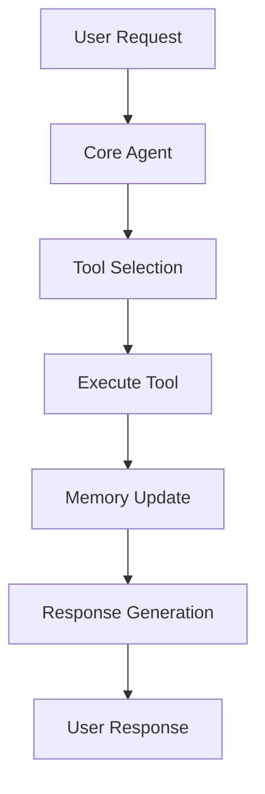

# Architecture Overview

*Version: 1.0.0*  
*Last Updated: 2025-06-20*  
*Maintainer: Red Team*

## Overview
This document outlines the high-level architecture of the Windsurf Agent Starter Template, including its components, data flow, and security considerations.

## System Components

### 1. Core Agent
- **Entry Point**: `src/main.py`
- **Responsibility**: Main execution flow and coordination
- **Dependencies**: Tools, Memory, MCP Servers

### 2. Tools
- **Location**: `src/tools/`
- **Purpose**: Extend agent capabilities
- **Auto-discovery**: Enabled via `agent_settings.json`

### 3. MCP Servers
- **Configuration**: `.windsurf/mcp_config.json`
- **Default Servers**:
  - Memory Server
  - Filesystem Server
  - GitHub MCP Server
  - Sequential Thinking Server

## Data Flow

## Security Considerations

- All sensitive data is stored in environment variables
- Tools run in isolated environments
- Memory persistence is configurable
- API authentication is required

## Changelog

### [1.0.0] - 2025-06-20
#### Added
- Initial architecture documentation
- System components overview
- Data flow diagram
- Security considerations

#### Changed
- Updated to follow new documentation standards

#### Removed
- N/A
